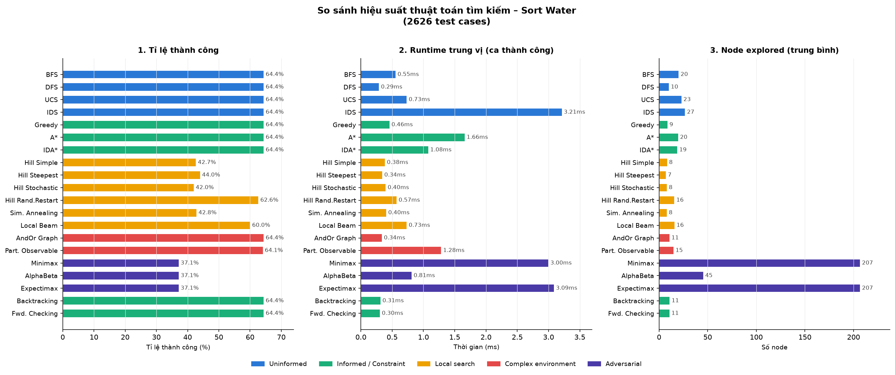
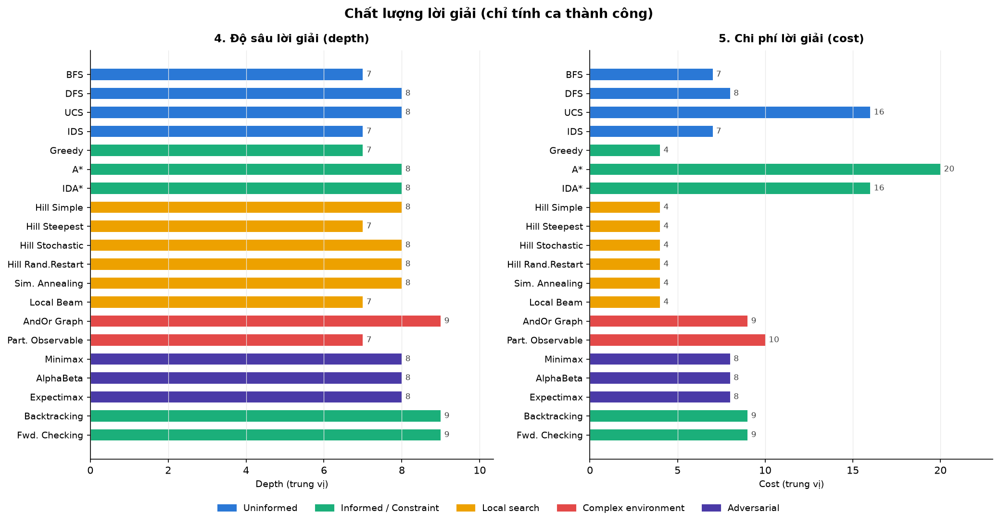
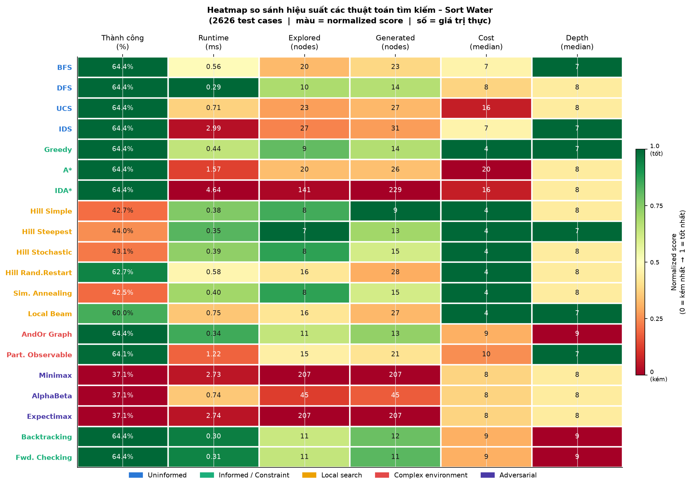

# 🧪 Water Sort Puzzle — AI Solver

> Dự án triển khai **19 thuật toán Trí tuệ Nhân tạo** để giải bài toán Water Sort Puzzle, kèm giao diện đồ họa tương tác được xây dựng bằng **Python + PyQt6**.

---

## 📋 Mục lục

1. [Giới thiệu](#-giới-thiệu)
2. [Giao diện & Demo](#-giao-diện--demo)
3. [Phát biểu bài toán](#-phát-biểu-bài-toán)
4. [Hệ thống thuật toán](#-hệ-thống-thuật-toán)
5. [Kiến trúc dự án](#-kiến-trúc-dự-án)
6. [Cài đặt & Chạy](#-cài-đặt--chạy)
7. [Hướng dẫn sử dụng](#-hướng-dẫn-sử-dụng)
8. [Kết quả thực nghiệm](#-kết-quả-thực-nghiệm)
9. [Hướng phát triển](#-hướng-phát-triển)

---

## 🎯 Giới thiệu

**Water Sort Puzzle — AI Solver** là trò chơi logic phân loại nước màu. Dự án này là **Đồ án môn học Trí tuệ Nhân tạo** do nhóm thực hiện. Nhóm đã biến bài toán này thành **môi trường thử nghiệm và mô phỏng trực quan thuật toán AI** nhằm:

- Quan sát **trực quan** cách từng thuật toán tìm kiếm lời giải thông qua hoạt ảnh (animation) sinh động.
- So sánh **hiệu năng** thực tế giữa các thuật toán (số lượng node đã duyệt, node được sinh ra, độ sâu lời giải và thời gian chạy).
- Đánh giá chi tiết **ưu và nhược điểm** của từng phương pháp tìm kiếm trên cùng một bài toán cụ thể.

### Công nghệ sử dụng

| Thành phần | Công nghệ |
|---|---|
| Ngôn ngữ | Python 3.10+ |
| Giao diện đồ họa | PyQt6 |
| Thuật toán | Thuần Python (không thư viện AI ngoài) |
| Kiến trúc | MVC (Model – View – Controller) |

---

## 🖥️ Giao diện & Demo

### Tổng quan hiệu năng thuật toán



### Chất lượng lời giải (Độ sâu & Chi phí)



### Heatmap thành công / thất bại trên 10 test cases



### Các chế độ hoạt động

| Chế độ | Mô tả |
|---|---|
| **Normal** | Chạy thuật toán tự động, xem hoạt ảnh đổ nước từng bước |
| **Partial Observable** | Tìm kiếm khi chỉ quan sát được một phần trạng thái (Belief States) |
| **Adversarial** | Chơi tương tác: Người vs. Máy (AI dùng Minimax / Alpha-Beta / Expectimax) |

---

## 📐 Phát biểu bài toán

### Biểu diễn trạng thái (State Representation)

Trạng thái được biểu diễn là một danh sách 4 lọ, mỗi lọ chứa tối đa 4 phần tử màu:

```python
# Ví dụ trạng thái khởi đầu
state = [
    [1, 3, 2, 2],   # Lọ 0: màu 1(đỏ) dưới cùng, 2(vàng) trên cùng
    [3, 2, 1, 3],   # Lọ 1
    [1, 3, 2, 1],   # Lọ 2
    []              # Lọ 3: rỗng
]

# Trạng thái đích (Goal State)
goal = [
    [1, 1, 1, 1],   # Lọ chứa toàn màu 1
    [2, 2, 2, 2],   # Lọ chứa toàn màu 2
    [3, 3, 3, 3],   # Lọ chứa toàn màu 3
    []              # Lọ rỗng
]
```

**Bảng màu:** `1` = 🔴 Đỏ/Hồng · `2` = 🟡 Vàng · `3` = 🔵 Xanh dương

### Thông số cố định

| Tham số | Giá trị | Mô tả |
|---|---|---|
| `CAPACITY` | 4 | Sức chứa tối đa của một lọ |
| `QUANTITY` | 4 | Số lọ trong bài toán |
| `MAX_STEPS` | 1000 | Giới hạn bước tìm kiếm (Local Search) |

### Ràng buộc hành động (Action Constraints)

Một hành động `(i1 → i2)` (**đổ nước từ lọ i1 sang lọ i2**) chỉ hợp lệ khi:

1. `i1 ≠ i2` — Không đổ vào chính nó
2. Lọ nguồn `i1` không rỗng
3. Lọ đích `i2` không đầy (chưa đủ 4 phần tử)
4. Màu trên cùng của `i1` = màu trên cùng của `i2`, **hoặc** `i2` hoàn toàn rỗng
5. Số phần tử được đổ = `min(số màu liên tiếp trên cùng của i1, số ô trống của i2)`

### Hàm chi phí

```
g(x) = 4 + (số màu liên tiếp còn lại ở i1) - (số màu đã đổ thành công)
h(x) = Σ (số ô trống của lọ) + Σ (số cặp màu khác nhau liền kề trong lọ)
f(x) = g(x) + h(x)   ← dùng cho A*, IDA*
```

> **Ý nghĩa của h(x):** Lọ càng nhiều ô trống và càng nhiều màu lẫn lộn thì h(x) càng lớn, thể hiện trạng thái còn xa mục tiêu.

### Điều kiện đích (Goal State)

Trạng thái đạt đích khi **mỗi lọ** thỏa một trong hai điều kiện:
- Chứa đúng 4 phần tử cùng màu (lọ đầy, thuần màu)
- Hoàn toàn rỗng

---

##  Hệ thống thuật toán

### 1. Uninformed Search — Tìm kiếm không có thông tin

Các thuật toán chỉ sử dụng cấu trúc bài toán, không có hàm ước lượng.

| Thuật toán | File | Complete | Optimal | Bộ nhớ | Đặc điểm |
|---|---|---|---|---|---|
| **Breadth First Search (BFS)** | `breadth_first_search.py` | ✅ | ✅ | O(b^d) | Duyệt theo từng tầng, tìm đường đi ngắn nhất |
| **Depth First Search (DFS)** | `depth_first_search.py` | ✅  | ❌ | O(b·d) | Duyệt theo chiều sâu, tiết kiệm bộ nhớ |
| **Iterative Deepening Search (IDS)** | `iterative_deepening_search.py` | ✅ | ✅ | O(b·d) | Kết hợp BFS+DFS: tối ưu bộ nhớ, tìm đường ngắn nhất |
| **Uniform Cost Search (UCS)** | `uniform_cost_search.py` | ✅ | ✅ | O(b^(C*/ε)) | Mở rộng theo chi phí thực g(x) |

### 2. Informed Search — Tìm kiếm có thông tin

Sử dụng hàm heuristic `h(x)` để định hướng tìm kiếm.

| Thuật toán | File | Complete | Optimal | Đặc điểm |
|---|---|---|---|---|
| **Greedy Search** | `greedy_search.py` | ✅  | ❌ | Chỉ theo h(x), nhanh nhưng không đảm bảo tối ưu |
| **A\* Search** | `a_star_search.py` | ✅ | ✅ | f(x) = g(x)+h(x), tối ưu nếu h(x) admissible |
| **IDA\* Search** | `ida_star_search.py` | ✅ | ✅ | A\* lặp sâu dần: tiết kiệm bộ nhớ, tương đương A\* |

### 3. Local Search — Tìm kiếm cục bộ

Tìm kiếm từ trạng thái hiện tại, không duy trì đường đi đầy đủ.

| Thuật toán | File | Đặc điểm |
|---|---|---|
| **Simple Hill Climbing** | `hill_climbing_search/simple.py` | Nhận bước đi **đầu tiên** tốt hơn trạng thái hiện tại |
| **Steepest Ascent HC** | `hill_climbing_search/steepest_ascent.py` | Nhận bước đi **tốt nhất** trong tất cả các bước khả thi |
| **Stochastic HC** | `hill_climbing_search/stochastic.py` | Chọn **ngẫu nhiên** một bước đi tốt hơn |
| **Random Restart HC** | `hill_climbing_search/random_restart.py` | Khởi động lại 20 lần từ trạng thái ngẫu nhiên |
| **Local Beam Search** | `local_beam_search.py` | Duy trì `beam_width=3` trạng thái tốt nhất song song |
| **Simulated Annealing** | `simulated_annealing_search.py` | Chấp nhận bước xấu theo xác suất `exp(-Δ/T)` giảm dần |

> ⚠️ **Lưu ý:** Khi thất bại (`success=False`), các thuật toán Local Search vẫn hiển thị đường đi đã đi được (từ trạng thái bắt đầu đến nơi bị kẹt) và cho phép xem hoạt ảnh từng bước.

### 4. Complex Environments — Môi trường phức tạp

| Thuật toán | File | Đặc điểm |
|---|---|---|
| **AND-OR Graph Search** | `and_or_graph_search.py` | Tìm kiếm trong môi trường không xác định (nondeterministic). Mô phỏng OR node (chọn action) và AND node (xử lý tất cả outcomes). |
| **Partially Observable Search** | `partially_observable_search.py` | Dùng Belief A\* trên tập Belief States. Chỉ chọn action hợp lệ trong **tất cả** belief states (phép giao — intersection). |

### 5. Constraint Satisfaction — Thỏa mãn ràng buộc

| Thuật toán | File | Đặc điểm |
|---|---|---|
| **Backtracking Search** | `backtracking_search.py` | Tìm kiếm quay lui chuẩn với kiểm tra trạng thái đã duyệt |
| **Forward Checking** | `forward_checking_search.py` | Quay lui + kiểm tra ràng buộc tiến: **chặn đổ lọ thuần màu sang lọ rỗng** (giảm không gian tìm kiếm) |

### 6. Adversarial Search — Tìm kiếm đối kháng

Chế độ **Người vs. Máy**: Máy sử dụng thuật toán để chọn nước đi tốt nhất.

| Thuật toán | File | Đặc điểm |
|---|---|---|
| **Minimax** | `minimax_search.py` | Máy tối đa hóa điểm, người tối thiểu hóa. Duyệt toàn bộ cây trò chơi. |
| **Alpha-Beta Pruning** | `alpha_beta_pruning_search.py` | Minimax + cắt nhánh α-β. Bỏ qua các nhánh không ảnh hưởng kết quả → nhanh hơn đáng kể. |
| **Expectimax** | `expectimax_search.py` | Người được coi là đi **ngẫu nhiên** (chance node). Máy tối đa, người lấy giá trị kỳ vọng trung bình. |

**Quy tắc thắng/thua:**
- Người hoàn thành xếp màu → **Người thắng**
- Máy hoàn thành xếp màu → **Máy thắng**
- Không còn nước đi hợp lệ → **Hòa**

---

## 📁 Kiến trúc dự án

### Cấu trúc thư mục

```
Final_Project_AI/
│
├── Main.py                              # Điểm khởi động ứng dụng
│
├── Core/                                # Nhân hệ thống — dùng chung cho mọi thuật toán
│   ├── Utils.py                         # Hằng số (CAPACITY, QUANTITY, MAX_STEPS), hàm tiện ích
│   ├── Action.py                        # Kiểm tra & thực thi hành động đổ nước
│   ├── Cost.py                          # Hàm chi phí g(x) và heuristic h(x)
│   ├── Node.py                          # Node cây tìm kiếm: expand(), get_path(), is_cycle()
│   └── Result.py                        # Dataclass kết quả chuẩn hóa từ mọi thuật toán
│
├── GUI/                                 # Giao diện đồ họa (kiến trúc MVC)
│   ├── View.py                          # Vẽ ống nghiệm, animation đổ nước, panel điều khiển
│   ├── Controller.py                    # Xử lý sự kiện, điều phối View ↔ Model, chạy thuật toán
│   └── Model.py                         # Lưu trạng thái ứng dụng (start state, result, mode...)
│
├── algorithms/
│   ├── uninformed_search/               # BFS, DFS, IDS, UCS
│   ├── informed_search/                 # Greedy, A*, IDA*
│   ├── local_search/
│   │   ├── hill_climbing_search/        # Simple, Stochastic, Steepest Ascent, Random Restart
│   │   ├── local_beam_search.py
│   │   └── simulated_annealing_search.py
│   ├── search_complex_environments/     # AND-OR Graph, Partially Observable (Belief A*)
│   ├── constraint_satisfaction_search/  # Backtracking, Forward Checking
│   └── adversarial_search/             # Minimax, Alpha-Beta, Expectimax, GameController
│
└── charts/                             # Biểu đồ kết quả thực nghiệm
    ├── fig1_overview.png               # Tổng quan hiệu năng
    ├── fig2_quality.png                # Chất lượng lời giải
    └── fig3_heatmap.png                # Heatmap thành công/thất bại
```

### Luồng dữ liệu (Data Flow)

```
[Người dùng chọn thuật toán]
        ↓
[Controller] → gọi algorithm_func(start_state)
        ↓
[Algorithm] → trả về Result(success, path, states, depth, explored, generated, runtime)
        ↓
[Controller] → cập nhật Model.result
        ↓
[View] → đọc result.states, vẽ animation từng bước
```

### Cấu trúc `Result` (Kết quả chuẩn hóa)

Mọi thuật toán đều trả về object `Result` thống nhất:

| Trường | Kiểu | Mô tả |
|---|---|---|
| `success` | `bool` | Có tìm được lời giải không |
| `path` | `List[tuple]` | Chuỗi hành động `(i1, i2)` từ start đến goal |
| `states` | `List[list]` | Chuỗi trạng thái tương ứng với từng bước |
| `depth` | `int` | Số bước đi (độ sâu của lời giải) |
| `cost` | `float` | Tổng chi phí tích lũy |
| `explored` | `int` | Số node đã mở rộng (expanded) |
| `generated` | `int` | Số node đã sinh ra (generated) |
| `runtime` | `float` | Thời gian thực thi (giây) |

---

## ⚙️ Cài đặt & Chạy

### Yêu cầu hệ thống

- **Python 3.10+** (bắt buộc — dùng `match/case` statement)
- **PyQt6 ≥ 6.4**
- Hệ điều hành: Windows / macOS / Linux

### Cài đặt

```bash
# 1. Clone repository
git clone https://github.com/<your-username>/Final_Project_AI.git
cd Final_Project_AI

# 2. Tạo môi trường ảo (khuyến nghị)
python -m venv .venv

# Windows
.venv\Scripts\activate

# macOS / Linux
source .venv/bin/activate

# 3. Cài đặt thư viện
pip install PyQt6

# 4. Chạy ứng dụng
python Main.py
```

---

## 📖 Hướng dẫn sử dụng

### Chế độ Normal (Tự động giải)

1. **Chọn nhóm thuật toán** từ dropdown "Chọn loại thuật toán"
2. **Chọn thuật toán cụ thể** từ dropdown "Chọn thuật toán"
3. *(Tùy chọn)* Nhấn **Random** để tạo trạng thái bắt đầu ngẫu nhiên
4. Nhấn **Execute** để chạy thuật toán
5. Quan sát các chỉ số hiệu năng: Explored, Generated, Depth, Cost, Runtime.
6. Sử dụng các nút điều khiển lời giải:
   - **Auto**: Tự động phát hoạt ảnh giải bài toán, tự động dừng nghỉ 0.5 giây ở mỗi trạng thái để dễ dàng quan sát.
   - **Pause**: Tạm dừng chạy tự động tại bước hiện tại.
   - **Next / Back**: Di chuyển thủ công tiến/lùi một bước.

### Chế độ Partially Observable

1. Chọn nhóm **"4. Complex Environments"** → **"Partially Observable Search"**
2. Nhấn **Execute** — giao diện sẽ hiển thị **2 Belief States** song song
3. Mỗi bước đổ nước hợp lệ trong **cả 2 belief states** mới được thực hiện

### Chế độ Adversarial (Người vs. Máy)

1. Chọn nhóm **"5. Adversarial Search"** → chọn thuật toán AI
2. Chọn lượt đi trước: **Máy đi trước** hoặc **Người đi trước**
3. Nhấn **Execute** để bắt đầu ván chơi
4. Khi đến lượt người: **click vào lọ nguồn** → **click vào lọ đích** để đổ nước
5. Máy tự động tính toán và đổ nước khi đến lượt

---

## 📊 Kết quả thực nghiệm

### Test Case mẫu (TC1)

```
Trạng thái: [[1,3,2,2], [3,2,1,3], [1,3,2,1], []]
Lời giải tối ưu: 9 bước
```

| Thuật toán | Success | Depth | Explored | Generated | Runtime |
|---|---|---|---|---|---|
| **BFS** | ✅ | 9 | 20 | 21 | ~0.001s |
| **DFS** | ✅ | 9 | 16 | 17 | ~0.000s |
| **UCS** | ✅ | 9 | 22 | 23 | ~0.001s |
| **IDS** | ✅ | 9 | 32 | 34 | ~0.001s |
| **Greedy** | ✅ | 9 | 9 | 15 | ~0.000s |
| **A\*** | ✅ | 9 | 19 | 23 | ~0.000s |
| **IDA\*** | ✅ | 9 | 9 | 19 | ~0.000s |
| **HC Simple** | ❌ | 8 | 9 | 11 | ~0.000s |
| **HC Steepest** | ✅ | 9 | 9 | 16 | ~0.000s |
| **HC Stochastic** | ❌ | 8 | 9 | 16 | ~0.000s |
| **HC Random Restart** | ✅ | 10 | 36 | 57 | ~0.000s |
| **Local Beam** | ✅ | 9 | 25 | 35 | ~0.000s |
| **Simulated Annealing** | ❌* | 2 | 4 | 7 | ~0.000s |
| **AND-OR Graph** | ✅ | 9 | 9 | 10 | ~0.000s |
| **Backtracking** | ✅ | 9 | 10 | 10 | ~0.000s |
| **Forward Checking** | ✅ | 9 | 10 | 10 | ~0.000s |

> *Simulated Annealing là thuật toán ngẫu nhiên, kết quả có thể thay đổi mỗi lần chạy.

### Nhận xét so sánh

| Tiêu chí | Thuật toán tốt nhất | Ghi chú |
|---|---|---|
| **Lời giải tối ưu (ngắn nhất)** | BFS, IDS, UCS, A\*, IDA\* | Đảm bảo tìm được depth=9 |
| **Nhanh nhất** | Greedy, IDA\*, HC Steepest | Explored ít nhất (~9 nodes) |
| **Tiết kiệm bộ nhớ** | IDA\*, DFS | Không lưu frontier lớn |
| **Thích nghi tốt nhất** | Random Restart HC | Vượt local minima bằng restart |
| **Tốt trong đối kháng** | Alpha-Beta > Minimax | Cắt nhánh giảm ~60% nodes |
| **Môi trường quan sát một phần** | Belief A\* | Đảm bảo action hợp lệ ở mọi belief state |

---

## 🔮 Hướng phát triển

- [ ] Mở rộng lên 6-8 màu và 8-10 ống
- [ ] Thêm thuật toán **MCTS (Monte Carlo Tree Search)**
- [ ] Tự động **sinh trạng thái có lời giải** với độ khó tùy chọn
- [ ] Giao diện **Web** (FastAPI + React)
- [ ] So sánh với thuật toán **Q-Learning / Deep RL**

---

Đây là sản phẩm đồ án môn học **Trí tuệ Nhân tạo** do nhóm  tự nghiên cứu, thiết kế giao diện và cài đặt thuật toán. Các thuật toán được triển khai dựa trên tài liệu chuẩn cuốn sách *Artificial Intelligence: A Modern Approach* (Russell & Norvig) và được minh họa thực nghiệm trên trò chơi Water Sort Puzzle. Hy vọng dự án nhỏ này của nhóm sẽ mang lại những góc nhìn trực quan và thú vị về các thuật toán tìm kiếm!
